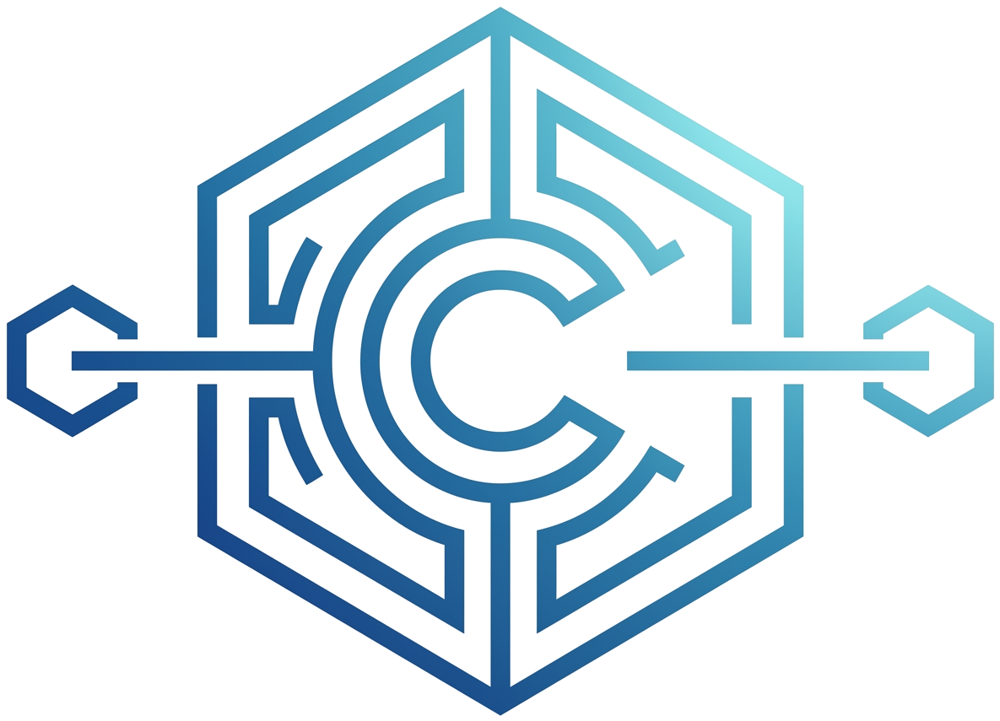

<p align="center">
  
</p>

<h1 align="center">CtrlC-Coin</h1>

<p align="center">
  <strong>A lightweight, pure Python blockchain implementation inspired by the Bitcoin protocol.</strong>
</p>

<p align="center">
  
  
  
  
</p>

---

## Overview

**CtrlC-Coin** is an educational, production-patterned cryptocurrency and blockchain node written in pure Python with zero external cryptography dependencies. Built on the core principles introduced in Satoshi Nakamoto's original Bitcoin design, CtrlC-Coin models Proof-of-Work (PoW) consensus, dynamic difficulty retargeting, block reward halving, asymmetric digital signatures, and P2P gossip state synchronization.

---

## Key Features

- **Proof-of-Work (PoW) Mining:** Nonce-based SHA-256 target hash difficulty validation.
- **Deflationary Monetary Policy:** Fixed supply schedule with automated block reward halving at configurable intervals.
- **Dynamic Difficulty Retargeting:** Automatically recalculates mining target difficulty based on actual vs. expected block generation time.
- **Asymmetric Cryptography:** Native RSA key pair generation (`e = 65537`), digital transaction signing, and public key verification.
- **Nakamoto Consensus:** Decentralized fork resolution via the Longest Valid Chain rule with orphaned transaction mempool recovery.
- **P2P Gossip Network:** REST-based peer discovery and transaction/block propagation across active nodes.
- **Dual Interfaces:** Interactive terminal CLI wallet alongside a modern Electron/Vite desktop explorer and dashboard.

---

## System Architecture

```
CtrlC-Coin/
├── block.py           # Block structure, hashing, and Proof-of-Work miner
├── transaction.py     # Transaction schemas and cryptographic verification
├── wallet.py          # RSA key management, digital signing, and address encoding
├── blockchain.py      # Core ledger engine: chain state, difficulty, halving & consensus
├── node.py            # HTTP REST API server & P2P gossip relay
├── config.py          # Central network parameters and economic constants
├── cli.py             # Interactive terminal multi-wallet client
├── start.ps1          # One-click node and Electron desktop GUI launcher
├── logo.png           # Project brand asset
└── frontend/          # Desktop explorer UI (Electron + Vite)
```

---

## Technical Specifications

| Parameter | Specification | Description |
| :--- | :--- | :--- |
| **Hashing Algorithm** | SHA-256 | Used for block header hashing and transaction integrity |
| **Signature Scheme** | RSA (2048-bit, $e=65537$) | Asymmetric key pairs for transaction authorization |
| **Consensus Mechanism** | Proof-of-Work (PoW) | Nakamoto Consensus (Longest Chain Rule) |
| **Initial Block Reward** | 50 Coins | Decreases by 50% every halving interval |
| **Halving Interval** | 5 Blocks *(configurable)* | Configured in `config.py` |
| **Block Target Time** | 10 seconds | Target block interval for difficulty adjustments |
| **Network Transport** | HTTP / REST JSON | Peer communication, gossip relay, and RPC |

---

## Getting Started

### Prerequisites

- **Python 3.10+** (standard library only; no pip dependencies required for core node)
- **Node.js 18+ & npm** *(optional, only required for running the Electron desktop UI)*

### 1. Running a Core Blockchain Node

To start a standalone node on the default port (`5000`):

```bash
python node.py 5000
```

To run a multi-node local network, launch secondary nodes on distinct ports:

```bash
python node.py 5001
python node.py 5002
```

### 2. Using the CLI Wallet

Launch the interactive multi-wallet terminal manager:

```bash
python cli.py
```

The CLI supports generating key pairs, checking address balances, creating digitally signed transactions, and viewing the local chain state.

### 3. Launching the Desktop UI (Electron + Vite)

To launch a node accompanied by the desktop visualizer:

```powershell
.\start.ps1 -Port 5000
```

---

## REST API Reference

Each node exposes standard HTTP endpoints for wallet interactions and P2P coordination:

| Method | Endpoint | Description |
| :--- | :--- | :--- |
| `GET` | `/chain` | Fetch the full blockchain and current height |
| `GET` | `/mine` | Trigger Proof-of-Work mining on pending transactions |
| `POST` | `/transactions/new` | Broadcast a new signed transaction to the mempool |
| `GET` | `/transactions/pending` | View current unconfirmed transactions |
| `GET` | `/balance/<address>` | Query the confirmed balance for an address |
| `POST` | `/nodes/register` | Register new peer nodes for gossip discovery |
| `GET` | `/nodes/resolve` | Execute consensus algorithm against registered peers |

---

## References & Attribution

The cryptographic mechanics, consensus logic, and monetary policy implemented in CtrlC-Coin are based on the architectural foundations of Bitcoin:

- **Nakamoto, S. (2008).** *Bitcoin: A Peer-to-Peer Electronic Cash System.*  
  [https://bitcoin.org/bitcoin.pdf](https://bitcoin.org/bitcoin.pdf)

---

## Disclaimer & License

### Disclaimer
This software is developed strictly for **educational and research purposes**. It is not designed or intended for production financial deployments or commercial monetary exchange.

### License
Distributed under the [MIT License](LICENSE). Open-source and free to modify for research and study.
